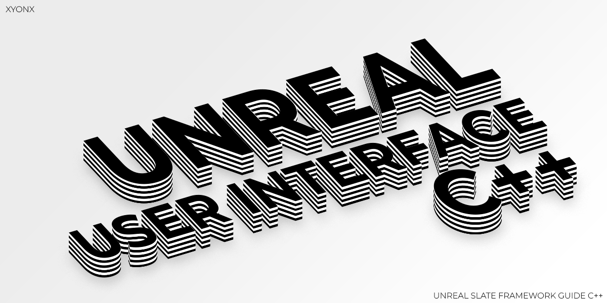

# Unreal Engine User Interface Design Using C++

# Slate Class Hierarchy

  

The Slate framework is a highly customizable UI toolkit that allows developers to create complex UI layouts with ease. It provides a low-level API for creating UI elements, which makes it ideal for creating custom UI elements that require fine-grained control over their behavior and appearance. By using the Slate framework, developers can create UI elements that integrate seamlessly with the game world and provide a more immersive experience for players

  

**In this documentation, we will explore how to create UI using the Slate framework in C++ on Unreal Engine**

  ## Base Widget Class

**SWidget :** Base slate class ( like UObject )

  

SWidget is the base class for all interactive Slate entities. SWidget's public interface describes everything that a Widget can do and is fairly complex as a result

  

  

Major Child Classes of **SWidget**

  

- SLeafWidget

- SCompoundWidget

  

These two class are major UI Class , the SLeafWidget class is for single element and the SCompoundWidge is for more customizable and can contain moany Leaf Widget element .

  

- All element class directly inherits from Class **SWidget**

- SLeafWidget

- SCompoundWidget

- SPanel

- SWeakWidget

- SEditableText

- SMultiLineEditableText

- SRichTextBlock

  

**SLeafWidget :**

  

SLeafWidget is a special class in the Slate framework that represents leaf widgets, i.e. widgets that don't contain any child widgets. It's an abstract class that can be used as a base class for creating custom leaf widgets

  

Leaf widgets are typically simple, self-contained widgets that don't have any child widgets of their own. Examples of leaf widgets include STextBlock, SButton, SImage, and so on .

  

Major Leaf Widget Classes

  

- SButton

- STextBlock

- SImage

- SBorder

- SCheckBox

- SPopup

- SScaleBox

- SScrollBox

- SSpinBox

- SToolTip

  

**SCompoundWidget :**

  

SCompoundWidget is one of the major child class of **SWidget .**

  

This class used for creating more complex element block which could contain many single element like SButton , STextBlock and more

  

**Example :** SExampleCompoundElement :

  

- SButton

- STextBlock

- SImage

- **This can be used as a single element**

- SWidget is the base class for all Slate widgets in Unreal Engine.

- Simple elements like buttons, images, and text blocks are derived directly from SWidget and represent basic building blocks of the UI.

- More complex UI elements can be constructed by combining simple elements and organizing them in a layout using SCompoundWidget or other derived classes.

- UWidget is a base class for UI elements in Unreal Engine's UMG (Unreal Motion Graphics) system.

- UUserWidget is a child class of UWidget and provides a way to create UI widgets using Blueprint visual scripting in addition to C++ code.

  

So, you can think of SWidget and its derived classes as building blocks, and SCompoundWidget and other derived classes as containers for those building blocks. UWidget and its derived classes, including UUserWidget, allow you to use those building blocks in the UMG system and create complex UI layouts using visual scripting or C++ code.
